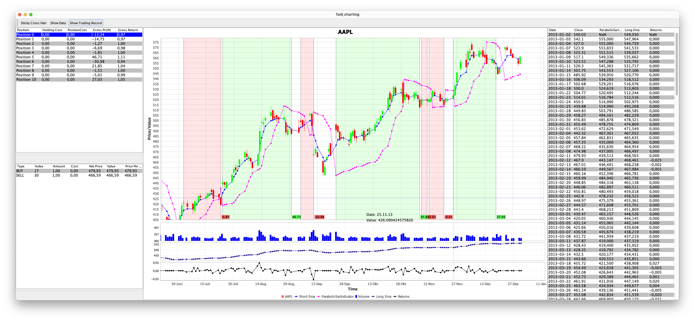

[](https://github.com/team172011/ta4jCharting/actions/workflows/test-action-master.yml) [](https://github.com/team172011/ta4jCharting/actions/workflows/test-action-develop.yml)
# Ta4jCharting
A simple charting application for [ta4j](https://github.com/ta4j/ta4j).

## How to build and start example
```shell
> git clone https://github.com/team172011/ta4jCharting.git
> cd ta4jCharting
> mvn clean package
> java -jar target/ta4j-charting-0.0.1-SNAPSHOT.jar
```

## How to use
```java
    // 1 Create a barSeries, indicators and run your strategy
    final BarSeries barSeries = loadAppleIncSeries();
    final VolumeIndicator volume = new VolumeIndicator(barSeries);
    final ParabolicSarIndicator parabolicSar = new ParabolicSarIndicator(barSeries);
    final ClosePriceIndicator closePrice = new ClosePriceIndicator(barSeries);
    final EMAIndicator longEma = new EMAIndicator(closePrice, 20);
    final EMAIndicator shortEma = new EMAIndicator(closePrice, 6);
    final CrossedDownIndicatorRule exit = new CrossedDownIndicatorRule(shortEma, longEma);
    final CrossedUpIndicatorRule entry = new CrossedUpIndicatorRule(shortEma, longEma);
    
    final Strategy strategy = new BaseStrategy(entry, exit);
    final TradingRecord tradingRecord = new BarSeriesManager(barSeries).run(strategy);
    
    final Returns returns = new Returns(barSeries, tradingRecord, Returns.ReturnType.ARITHMETIC);
    
    // 2 Add your ta4j objects to a ChartBuilder instance
    final ChartBuilder chartBuilder = new ChartBuilderImpl(barSeries);

        chartBuilder.addIndicator(volume, PlotType.SUBPLOT, ChartType.BAR);
        chartBuilder.addIndicator(parabolicSar, PlotType.OVERLAY, ChartType.LINE);
        chartBuilder.addIndicator(longEma, PlotType.SUBPLOT, ChartType.LINE);
        chartBuilder.addIndicator(shortEma); // default: PlotType.OVERLAY, ChartType.LINE
        chartBuilder.addIndicator(returns, PlotType.SUBPLOT); // default: ChartType.LINE
        chartBuilder.setTradingRecord(tradingRecord);

        // 3 Create JFrame
        javax.swing.SwingUtilities.invokeLater(() -> {
            final JFrame frame = new JFrame("Ta4j charting");
            frame.setLayout(new BorderLayout());
            frame.setDefaultCloseOperation(JFrame.EXIT_ON_CLOSE);
    
            // 4 add the plot to a JFrame
            frame.add(chartBuilder.createPlot());
            frame.pack();
            frame.setVisible(true);
        });
```

